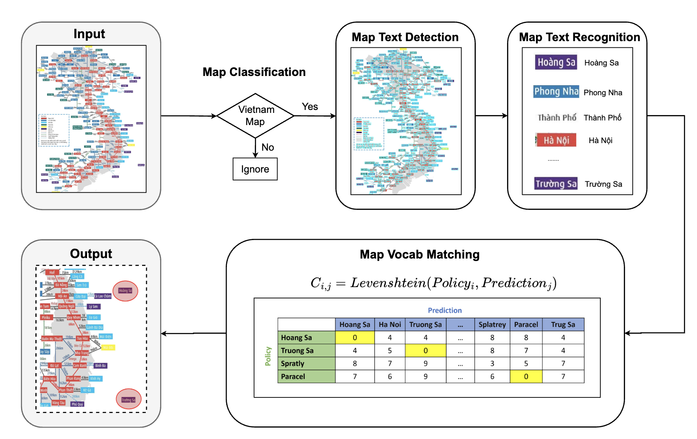

##### Table of contents
1. [Installation](#Installation)
2. [Dataset](#Dataset) 
3. [Training](#Training)
4. [Inference](#Inference)
5. [Acknowledgments](#Acknowledgments)

# Detecting Omissions in Geographic Maps through Computer Vision ([MAPR'24](https://mapr.uit.edu.vn/))

by [Phuc Nguyen](https://phucnda.github.io/), [Anh Do](https://english.mic.gov.vn/information-center-197114238.htm), and [Minh Hoai](https://researchers.adelaide.edu.au/profile/minhhoai.nguyen)

<a href="https://arxiv.org/abs/2312.10671"></a>


> **Abstract**: 
This paper explores the application of computer vision technologies to the analysis of maps, an area with substantial historical, cultural, and political significance. Our focus is on developing and evaluating a method for automatically identifying maps that depict specific regions and feature landmarks with designated names, a task that involves complex challenges due to the diverse styles and methods used in map creation. We address three main subtasks: differentiating maps from non-maps, verifying the accuracy of the region depicted, and confirming the presence or absence of particular landmark names through advanced text recognition techniques. Our approach utilizes a Convolutional Neural Network and transfer learning to differentiate maps from non-maps, verify the accuracy of depicted regions, and confirm landmark names through advanced text recognition. We also introduce the VinMap dataset, containing annotated map images of Vietnam, to train and test our method. Experiments on this dataset demonstrate that our technique achieves F1-score of 85.51% for identifying maps excluding specific territorial landmarks. This result suggests practical utility and indicates areas for future improvement. 



Details of the model architecture and experimental results can be found in [our paper](https://arxiv.org/abs/2312.10671):
```bibtext
@inproceedings{nguyen_vinmap,
  title={Detecting Omissions in Geographic Maps through Computer Vision}, 
  author={Nguyen, Phuc and Anh, Do and Minh Hoai},
  year={2024},
  booktitle={2024 International Conference on Multimedia Analysis and Pattern Recognition (MAPR)}
}
```
**Please CITE** our paper whenever this repository is used to help produce published results or incorporated into other software.


## Installation :hammer:

Please refer to [installation guide](docs/install.md)

## Dataset :open_file_folder:

Please refer to [dataset preparation guide](docs/dataset.md)

## Training :running:
After setting up data, follow this guide for training. (Minimum requirements: 40GB)
### Map Classification
Inside *classification* directory
#### Classification #1: Map Classification
``` python
# Classify the image is a map or not
python train_map.py
```
#### Classification #2: Vietnam Map Classification

``` python
# Classify the image is Vietnam map or not
python train_vn.py
```
### Text Detection
Inside *mmocr* directory
``` python
# Mask all detected text using Mask R-CNN
python tools/train.py ./configuration/maskrcnn_resnext101_DCN_160e_icdar
```
### Text Recognition
Inside *vietocr* directory
``` python
# Recognize masked texts
python train.py
```
After running following comand, it will automatically convert data format to .lmdb and train your model
## Inference :rocket:

Running the code will print our info about the map:

* ('This is VN map. It does not contain (Truong Sa and Hoang Sa).. ALERT')

* ('This is not VN map.. SKIPPED')

* ('This is VN map, It contains (Truong Sa or Hoang Sa).. OK')

* ...

### Academic version:

(Minimum requirements: 24GB)

This version we use to reproduce quantitative results of our paper. Include training, testing code:

``` python 
export PYTHONPATH='/root/VinMap'
# GPU
python -W ignore single_infer.py --single_infer_image <image_path> --single_infer_path '../temp'
# CPU
python -W ignore single_infer_cpu.py --single_infer_image <image_path> --single_infer_path '../temp'
```
### Industry version:
(Minimum requirements: 8GB)

This version is confidential and for industrial use only. Include testing, demo code.

#### Testing:

```python
export PYTHONPATH='/root/VinMap'
# GPU
python -W ignore single_infer_optimize.py --single_infer_image <image_path> --single_infer_path '../temp'
```

#### Drag and drop:
```python
# Gradio demo
python gradio_demo.py
```

## Acknowledgments

We sincerely thank the MIC-VN team for
data crawling and labeling. We thank Mr. Que Nguyen and his
team for their support in testing and deployment.

## Contacts

If you have any questions or suggestions about this repo, please feel free to contact me (phucnda@gmail.com).

  